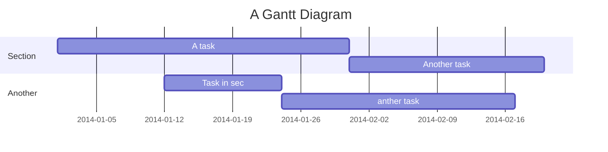

QCTools-IBMQ
===


## Table of Contents

[TOC]

## Beginners Guide

If you are a total beginner to this, start here!

1. Visit hackmd.io
2. Click "Sign in"
3. Choose a way to sign in
4. Start writing note!

User story
---

```gherkin=
Feature: Guess the word

  # The first example has two steps
  Scenario: Maker starts a game
    When the Maker starts a game
    Then the Maker waits for a Breaker to join

  # The second example has three steps
  Scenario: Breaker joins a game
    Given the Maker has started a game with the word "silky"
    When the Breaker joins the Maker's game
    Then the Breaker must guess a word with 5 characters
```
> I choose a lazy person to do a hard job. Because a lazy person will find an easy way to do it. [name=Bill Gates]


```gherkin=
Feature: Shopping Cart
  As a Shopper
  I want to put items in my shopping cart
  Because I want to manage items before I check out

  Scenario: User adds item to cart
    Given I'm a logged-in User
    When I go to the Item page
    And I click "Add item to cart"
    Then the quantity of items in my cart should go up
    And my subtotal should increment
    And the warehouse inventory should decrement
```

> Read more about Gherkin here: https://docs.cucumber.io/gherkin/reference/

User flows
---
```sequence
Alice->Bob: Hello Bob, how are you?
Note right of Bob: Bob thinks
Bob-->Alice: I am good thanks!
Note left of Alice: Alice responds
Alice->Bob: Where have you been?
```

> Read more about sequence-diagrams here: http://bramp.github.io/js-sequence-diagrams/

Project Timeline
---


> Read more about mermaid here: http://mermaid-js.github.io/mermaid/

## Appendix and FAQ

:::info
**Find this document incomplete?** Leave a comment!
:::

###### tags: `Templates` `Documentation`


## Quick Start
<br>
a. plot by simulator
<br/>
b. plot by ibm quantum meachine (need ibm account)

both need to run IBMqiskitplot_samplecode.py, and modify it
### used pakages (2 types process to get)
 <br>python 3.6 <br/>
 <br> requirement.txt <br/>
 <br> or <br/>
 <br> pip install quiskit、
                  matpoltlib <br/>
 
### a. plot your first circuit by qasm_simulator
  #### comment these code
  

  #### copy and paste your circuit code between the sign 【circuit Start】&【circuit End】，see the follwing figure.
  
  <br><br/>
  
  or use this test code
  
  ```qreg_q = QuantumRegister(1, 'q')
  creg_c = ClassicalRegister(1, 'c')
  circuit = QuantumCircuit(qreg_q, creg_c)
  circuit.h(qreg_q[0])
  circuit.measure(qreg_q[0], creg_c[0])
  ```


  then run IBMqiskitplot_samplecode.py

### b. plot your first circuit by ibm quantum machine
  #### step 1. enter your account token
  login ibm quantum platform and get account token , or quick login click https://quantum-computing.ibm.com/login
  <br><br/>
  input the token here see figure
  
  and cooment this 
  


  #### step 2. copy and paste your circuit code between the sign 【circuit Start】&【circuit End】，see the follwing figure.
  
  <br><br/>
  
  or use this test code
  
  ```qreg_q = QuantumRegister(1, 'q')
  creg_c = ClassicalRegister(1, 'c')
  circuit = QuantumCircuit(qreg_q, creg_c)
  circuit.h(qreg_q[0])
  circuit.measure(qreg_q[0], creg_c[0])
  ```


  then run IBMqiskitplot_samplecode.py
  
    


